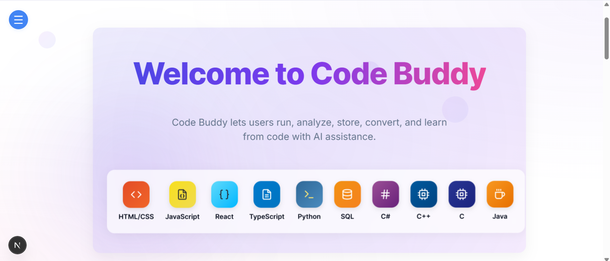
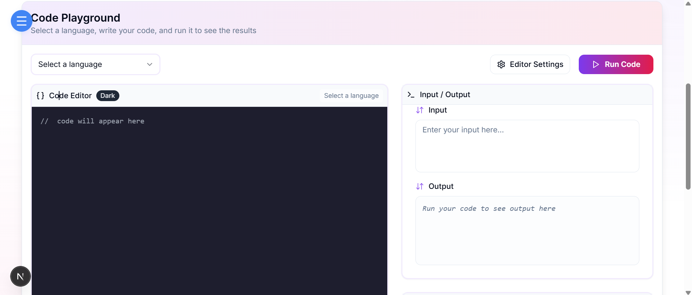
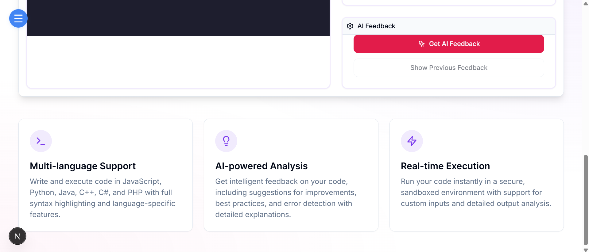
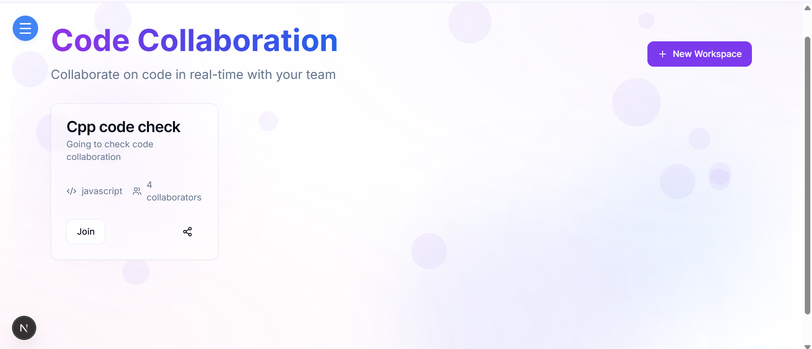
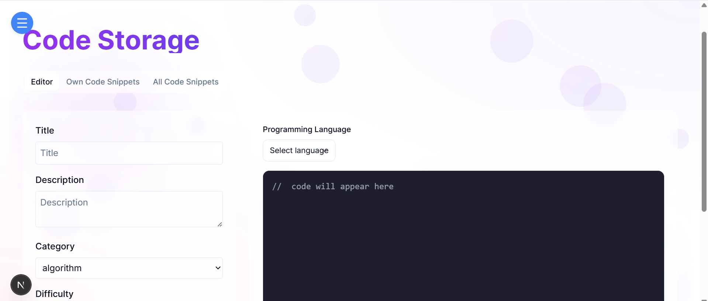

# 🚀 Code Buddy

## 🎯 Overview

Code Buddy is a platform that enables users to: 
✅ Run single-file code and analyze outputs, including error detection and AI-generated solutions.  
✅ Store and manage code with descriptive metadata for easy search and retrieval. 
✅ Convertimage-based code to text for execution. 
✅ Generate AI-driven personalized learning schedules. 
✅ Collaborate in real-time with other developers. 

🔹 The software includes both free and premium features, with a comprehensive admin dashboard for management.

---

## ⚡ Functional Requirements

### 🔹 1. Code Execution and Error Analysis

#### 👨‍💻 User Features:

* ✏ **Input Code:** Users can write single-file code in supported languages.
* ▶ **Run Code:** Execute the written code.
* 🔍 **Error Detection:** If the output contains errors, AI integration (OpenAI) will:

  * 📊 Analyze the error.
  * 🛠 Provide potential causes.
  * 💡 Suggest solutions.

#### 🔧 Backend Requirements:

* 🖥 API to handle code execution.
* 🤖 Integration with OpenAI for error analysis.

---

### 🔹 2. Code Storage and Management

#### 👨‍💻 User Features:

* 💾 **Store Code:** Save code snippets with:

  * 🏷 Title.
  * 📝 Description.
  * 🔖 Tags.
* 🔎 **Search and Retrieve:** Search for stored code using keywords or tags.

#### 🔧 Backend Requirements:

* 🛢 MongoDB database schema to store code with metadata.
* 📡 APIs to:

  * 💾 Save code.
  * 🔄 Retrieve code.
  * ❌ Update/delete code entries.

---

### 🔹 3. Image to Code Conversion (Premium Feature)

#### 👨‍💻 User Features:

* 📤 **Upload Image:** Accept images containing code blocks.
* 🔠 **Convert to Text:** Use AI to:

  * 🔍 Extract text from the image.
  * 🖥 Format the extracted text as code.
* ▶ **Run Extracted Code:** Execute the generated code directly.

#### 🔧 Backend Requirements:

* 📷 Integration with OCR tools for text extraction.
* 📡 APIs to:

  * 📜 Process images.
  * 🔠 Convert text to code.
  * ▶ Execute the code.

---

### 🔹 4. AI-Generated Learning Schedules (Premium Feature)

#### 👨‍🎓 User Features:

* 🏆 **Input Learning Goals:** Users specify:

  * 📚 Topics to learn.
  * ⏳ Desired timeframe.
* 🗓 **Generate Schedule:** AI provides:

  * 🚀 A learning path.
  * 📆 A calendar with daily tasks.

#### 🔧 Backend Requirements:

* 🤖 Integration with OpenAI for generating schedules.
* 📡 APIs to:

  * 📥 Accept user inputs.
  * 📜 Generate and return the learning schedule.

---

### 🔹 5. 🤝 Collaborative Coding

#### 👨‍💻 User Features:

* 👥 **Real-Time Collaboration:** Multiple users can access and edit the same code file simultaneously.
* 💬 **Live Sync:** Changes made by one collaborator are instantly reflected for others.
* 🔐 **Access Control:** File owners can control who can view or edit.
* 📝 **Commenting & Annotations:** Team members can leave inline feedback and notes.

#### 🔧 Backend Requirements:

* 🔄 WebSocket or real-time database integration (e.g., Firebase, Socket.io) for live collaboration.
* 🔑 Role-based access management for collaboration rights.
* 📡 APIs to:

  * 🧑‍🤝‍🧑 Manage collaborators.
  * 🔄 Sync code edits in real time.
  * 🔏 Handle access permissions.

---

## 🔒 Non-Functional Requirements

1. **⚙ Scalability:** Supports multiple simultaneous code executions and API calls.
2. **🔐 Security:** JWT-based authentication, secure storage of user data and subscriptions.
3. **⚡ Performance:** Fast response times for code execution and AI-based analysis.
4. **🖥 Usability:** Intuitive UI with React and clear documentation.

---

## 🛠 Technology Stack

### 🏗 Backend:

* 🟢 Node.js with Express.js for API development.
* 🍃 Mongoose for MongoDB database integration.
* 🤖 OpenAI APIs for AI functionalities.

### 🎨 Frontend:

* ⚛ Next.js for the user interface.

### 🛢 Database:

* 🍃 MongoDB for data storage.

### 💳 Premium Features:

* 💰 SSL Commerz payment integration for subscription management.

---

## 🗂️ Pages

### Home Page

### Code Execution

### Code Collaboration

### Code Storage

## 💰 Business Model

### 🎟 Premium Features:

1. 📷 Image to Code Conversion.
2. 📅 AI-Generated Learning Schedules.

### 💲 Revenue Streams:

* 📜 Subscription plans for accessing premium features.

---

## 🎯 Conclusion

🚀 **Code Buddy** simplifies coding, learning, and problem-solving using cutting-edge AI technologies while offering a seamless user experience and scalable architecture.

🌟 *Empowering developers with AI-driven coding solutions!*

---
